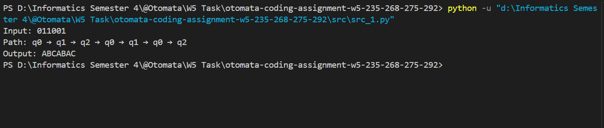

# Tugas Minggu ke-5 Otomata
| Name           | NRP        | Kelas     | Kelompok    |
| ---            | ---        | ----------| ---         |
| Algof Kristian Zega | 5025231235 | Otomata (E) | Kelompok 5 |
| Gregorius Setiadharma | 5025231268 | Otomata (E) | Kelompok 5 |
| Muhammad Davin Aulia Risky | 5025231275 | Otomata (E) | Kelompok 5 |
| Muhammad Aditya Handrian | 5025231292 | Otomata (E) | Kelompok 5 |

## Program Simulator Moore Machine

> Implement Moore Machine. Write explanation, how to use, example input and output

- Screenshot


- Source code 1

    ```py
    import json

    def run_moore(data):
        states = data['states']
        transitions = data['transitions']
        initial_state = data['initial_state']
        test_string = data['test_string']
        
        current_state = initial_state
        path = [current_state]
        output = [states[current_state]]
        
        for symbol in test_string:
            current_state = transitions[current_state][symbol]
            path.append(current_state)
            output.append(states[current_state])

        print("Input:", test_string)
        print("Path:", " → ".join(path))
        print("Output:", "".join(output))

    sample_input_1 = '''
    {
        "states" : {
            "q0" : "A",
            "q1" : "B",
            "q2" : "C"
        },
        "transitions" : {
            "q0" : {"0" : "q1", "1" : "q2"},
            "q1" : {"0" : "q0", "1" : "q2"},
            "q2" : {"0" : "q1", "1" : "q0"}
        },
        "initial_state" : "q0",
        "test_string" : "011001"
    }
    '''

    data = json.loads(sample_input_1)

    run_moore(data)
    ```

- Explanation src_1:  

Fungsi run_moore(data) menjalankan proses simulasi Moore Machine. Variabel *data* menyimpan data input berbentuk JSON. Langkah pertama yang dilakukan dalam fungsi adalah mengambil data dari dictionary *data* yang kemudian kedalam variabel states, transitions, initial_state, dan test_string.  

Langkah berikutnya adalah melakukan inisialisasi state awal. Hal ini dilakukan dengan mengisi current_state dengan initial_state, mengisi list path dengan current_state, dan mengisi list output dengan output dari current_state (memanfaatkan dictionary).  

Kemudian dibuat loop untuk setiap karakter pada test_string alias symbol. Setiap symbol akan diperiksa, current_state akan diganti dengan next state sesuai dengan current_state dan symbol pada transition (memanfaatkan nested dictionary untuk mencari next state). Current_state yang baru kemudian akan ditambahkan ke dalam list path. Kemudian output dari current_state yang baru juga akan ditambahkan ke dalam list output. Hal ini akan diulang hingga mencapai akhir dari test_string.

Langkah terakhir yang dilakukan adalah melakukan printing mulai dari input, path, dan output (memanfaatkan join elemen dari list).

- Source code 2
    ```py
    import json

    def run_moore(data):
        states = data['states']
        transitions = data['transitions']
        initial_state = data['initial_state']
        test_string = data['test_string']
        
        current_state = initial_state
        path = [current_state]
        output = [states[current_state]]
        
        for symbol in test_string:
            current_state = transitions[current_state][symbol]
            path.append(current_state)
            output.append(states[current_state])

        print("Input:", test_string)
        print("Path:", " → ".join(path))
        print("Output:", "".join(output))

    # Ubah bila diperlukan, tergantung dari direktori mana kita menjalankan kode python ini
    file_path = "src/input.json"

    try:
        with open(file_path, "r") as file:
            data = json.load(file)
            run_moore(data)
    except FileNotFoundError:
        print(f"Error: File '{file_path}' tidak ditemukan.")
    except json.JSONDecodeError as e:
        print("Error: Format JSON tidak valid.")
    ```

- Explanation src_2:  

Untuk mempermudah pengetesan dengan input yang bervariasi maka kami membuat modifikasi kode agar input dapat diperoleh dengan membaca file. Hal ini membuat kode menjadi lebih modular dalam menerima input sebab tidak perlu mengubah kode hanya perlu mengubah isi file input.  
